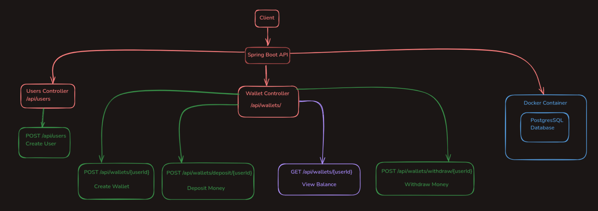

# Wallet API



A Spring Boot REST API that enables user management and wallet operations including creating users, managing wallets, and handling deposits/withdrawals.

### API Design Notes

- **User-Wallet Relationship**: There's a one-to-one relationship between users and wallets. Each user has exactly one wallet, and each wallet is associated with only one user. This relationship is implicit in API endpoints where operations are performed using the `userId`.


## Technologies Used

- Java 17
- Spring Boot
- PostgreSQL
- Docker
- JPA/Hibernate
- Maven

## Prerequisites

Before running this application, make sure you have the following installed:

- Java Development Kit (JDK) 17 or later
- Docker and Docker Compose
- Maven
- Git

## Getting Started

### 1. Clone the Repository

```bash
git clone https://github.com/kristiyankiryakov/Wall-e.git
cd Wall-e
```

### 2. Database Setup

The application uses PostgreSQL running in a Docker container. Start the database using Docker Compose:

```bash
docker compose up
```

This will start a PostgreSQL instance with the following configuration:
- Port: 5432
- Database: postgres
- Username: postgres
- Password: postgres

### 3. Configure Application

The application is configured using `application.yml`. The default configuration is:

```yaml
spring:
  datasource:
    url: jdbc:postgresql://localhost:5432/postgres
    username: postgres
    password: postgres
  jpa:
    hibernate:
      ddl-auto: update
    properties:
      hibernate:
        dialect: org.hibernate.dialect.PostgreSQLDialect
```

### 4. Build and Run

Build the application using Maven:

```bash
mvn clean install
```

Run the application:

```bash
mvn spring-boot:run
```

The API will be available at `http://localhost:8080`

## API Endpoints

### Users

#### Create User
- **POST** `/api/users`
- Creates a new user account
- Request Body (`UserDto`):
  ```json
  {
    "name": "string",         // Required
    "email": "string",        // Required, must be valid email
    "password": "string"      // Required
  }
  ```
- Response (`UserResponseDto`):
  ```json
  {
    "userId": "number",
    "name": "string",
    "email": "string"
  }
  ```

### Wallets

#### Create Wallet
- **POST** `/api/wallets/{userId}`
- Creates a new wallet for a user
- Path Variables:
  - `userId`: The ID of the user
- Response (`WalletResponse`):
  ```json
  {
    "userDetails": {
      "userId": "number",
      "name": "string",
      "email": "string"
    },
    "balance": "number"
  }
  ```

#### Deposit Money
- **PUT** `/api/wallets/deposit/{userId}`
- Adds funds to a wallet
- Path Variables:
  - `userId`: The ID of the user
- Request Body (`TransactionRequest`):
  ```json
  {
    "amount": "number"    // Required, must be positive
  }
  ```
- Response (`TransactionResponse`):
  ```json
  {
    "walletId": "number",
    "userId": "number",
    "previousBalance": "number",
    "currentBalance": "number",
    "transactionType": "string",
    "transactionAmount": "number"
  }
  ```

#### Withdraw Money
- **PUT** `/api/wallets/withdraw/{userId}`
- Withdraws funds from a wallet
- Path Variables:
  - `userId`: The ID of the user
- Request Body (`TransactionRequest`):
  ```json
  {
    "amount": "number"    // Required, must be positive
  }
  ```
- Response (`TransactionResponse`):
  ```json
  {
    "walletId": "number",
    "userId": "number",
    "previousBalance": "number",
    "currentBalance": "number",
    "transactionType": "string",
    "transactionAmount": "number"
  }
  ```

#### View Balance
- **GET** `/api/wallets/{userId}`
- Retrieves the current wallet balance
- Path Variables:
  - `userId`: The ID of the user
- Response (`WalletResponse`):
  ```json
  {
    "userDetails": {
      "userId": "number",
      "name": "string",
      "email": "string"
    },
    "balance": "number"
  }
  ```

## Testing

### Running Tests

Execute the test suite using Maven:

```bash
mvn test
```

### Manual Testing

You can use tools like Postman or curl to test the API endpoints. Here's an example using curl:

```bash
# Create a new user
curl -X POST http://localhost:8080/api/users \
  -H "Content-Type: application/json" \
  -d '{"name": "John Doe", "email": "john@example.com", "password": "john123"}'

```

[Previous sections remain the same until Contributing...]

## CI/CD Pipeline

This project uses GitHub Actions for continuous integration and deployment. The pipeline is triggered on:
- Push to the `main` branch
- Pull requests to the `main` branch

### Pipeline Overview

The workflow file is located at `.github/workflows/ci-cd.yml` and consists of the following steps:

#### Build Job

The build job runs on Ubuntu latest and sets up a PostgreSQL service container for integration tests.

##### Database Container Configuration
- Image: postgres:latest
- Credentials:
  - Username: postgres
  - Password: postgres
  - Database: postgres
- Port: 5432
- Health checks configured for reliability

##### Steps

1. **Checkout Code**
  - Uses: `actions/checkout@v3`
  - Fetches the repository code

2. **Setup JDK**
  - Uses: `actions/setup-java@v3`
  - Configures JDK 17 (Temurin distribution)

3. **Cache Dependencies**
  - Uses: `actions/cache@v3`
  - Caches Maven dependencies to speed up builds
  - Cache key based on pom.xml hash

4. **Build Project**
  - Runs: `mvn clean install`
  - Compiles the code and packages the application

5. **Run Tests**
  - Runs: `mvn test -X`
  - Executes all tests with detailed logging

### Workflow File

```yaml
name: Java CI/CD Pipeline

on:
  push:
    branches:
      - main
  pull_request:
    branches:
      - main

jobs:
  build:
    runs-on: ubuntu-latest

    services:
      postgres:
        image: postgres:latest
        env:
          POSTGRES_USER: postgres
          POSTGRES_PASSWORD: postgres
          POSTGRES_DB: postgres
        ports:
          - 5432:5432
        options: --health-cmd="pg_isready -U user" --health-timeout=30s --health-start-period=5s --health-retries=3

    steps:
      - name: Checkout code
        uses: actions/checkout@v3

      - name: Set up JDK 17
        uses: actions/setup-java@v3
        with:
          java-version: 17
          distribution: 'temurin'

      - name: Cache Maven repository
        uses: actions/cache@v3
        with:
          path: ~/.m2
          key: ${{ runner.os }}-maven-${{ hashFiles('**/pom.xml') }}
          restore-keys: |
            ${{ runner.os }}-maven

      - name: Build with Maven
        run: mvn clean install

      - name: Run tests
        run: mvn test -X
```

### Pipeline Status

You can view the status of pipeline runs in the "Actions" tab of the GitHub repository.
